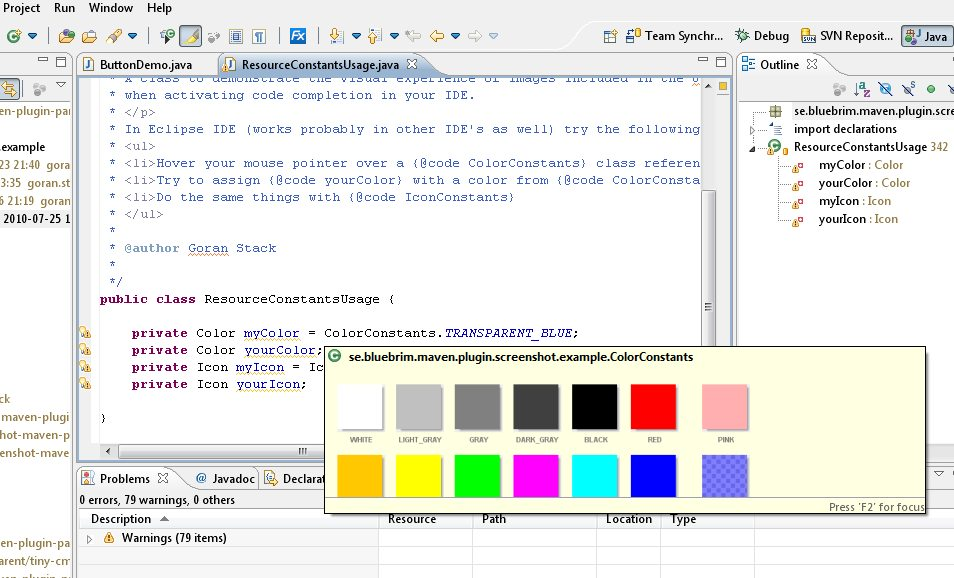

= Getting started with Eclipse

. Download and install JDK 8
. Download latest Eclipse for Java development
. Clone the git repo
. In Eclipse Package Explorer right click -> New -> Project -> General -> Project and give the project a name that
 is *not* a Maven module in the project. The name of the branch for example.

 . Drag and drop the cloned repo to the project you created in Eclipse

 . Select create links when prompted by Eclipse

 . Right click on the `screenshot-maven-plugin` folder in Eclipse Package Explorer and
 Import... -> Maven -> Existing Maven Projects.
 Press the Next button

 . Press the Finish button

Your Eclipse workspace should now be populated with the modules of the `screenshot-maven-plugin`
project. The dependency jars should be automatically downloaded by Maven.

See screen shots in action by open the class `ResourceConstantsUsage` and hover the mouse over
the `ColorConstants` class.

