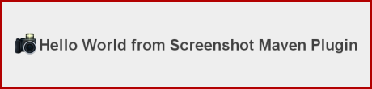

= Configure your pom files
:toc: left
:icons: font
:sectnums:

We assume that you have a multi module project and the screenshot gallery should be aggregated from several
modules and published with GitHub pages.

== Configuration in the parent pom

=== Specify the following properties

[source, xml]
----
<properties> 
    <screenshot-maven-plugin.version>0.0.7</screenshot-maven-plugin.version>
    <rootDirectory>${project.basedir}</rootDirectory>
    <localRepositoryPath>${rootDirectory}/maven-repo</localRepositoryPath>
    <screenshotGalleryTarget>${rootDirectory}/asciidoc/target/gallery-src</screenshotGalleryTarget>
</properties>
----

=== Add a plugin element to the pluginManagement part

[source, xml]
----
<pluginManagement>
    <plugins>
        <plugin>
            <groupId>se.bluebrim.maven.plugin</groupId>
            <artifactId>screenshot-maven-plugin</artifactId>
            <version>${screenshot-maven-plugin-version}</version>
            <configuration>
                <goalPrefix>screenshot</goalPrefix>
                <sourceCodeURL>${project.scm.url}/src/main/java</sourceCodeURL>
                <javaDocImageScale>0.6</javaDocImageScale>
                <locales>
                    <localeSpec>
                        <language>sv</language>
                        <country>SE</country>
                    </localeSpec>
                </locales>
            </configuration>
            <executions>
                <execution>
                    <id>create-gallery</id>
                    <phase>verify</phase>
                    <goals>
                        <goal>gallery</goal>
                    </goals>
                    <configuration>
                        <outputDirectory>${screenshotGalleryTarget}</outputDirectory>
                    </configuration>
                </execution>
            </executions>
        </plugin>
        .
        .
        .
    </plugins>
</pluginManagement>
----

Add a dependency element to the dependencyManagement part 

[source, xml]
----
<dependencyManagement>
    <dependencies>
        <dependency>
            <groupId>se.bluebrim.maven.plugin</groupId>
            <artifactId>screenshot-maven-plugin-api</artifactId>
            <version>${screenshot-maven-plugin.version}</version>
            <scope>test</scope>
        </dependency>
        .
        .
        .
    </dependencies>
</dependencyManagement>
----

== Configuration in module pom
Add the following to the pom files of modules containing Swing classes that you like to generate screenshots of.

[source, xml]
----
<dependencies>
    <dependency>
        <groupId>se.bluebrim.maven.plugin</groupId>
        <artifactId>screenshot-maven-plugin-api</artifactId>
    </dependency>
    .
    .
    .
</dependencies>
----

The configuration above makes it possible to annotate test class method with `@Screenshot`.
Since its most convenient to run the javadoc goal from command line you don't have to
add any plugin configuration in the build section. To run the `gallery` as part of your Maven build
add the following in the build section:
[source, xml]
----
<plugins>
    <plugin>
        <groupId>se.bluebrim.maven.plugin</groupId>
        <artifactId>screenshot-maven-plugin</artifactId>
    </plugin>
</plugins>
----

== Add a gh-pages module
To create an aggregated screenshot gallery you need a common output directory for all modules that
provides content to the gallery. This module also contains the AsciiDoc configuration necessary to
process the generated Asciidoc to html.

== Test your configuration
Verify the configuration by adding the following classes to one of those modules:

In `src/main/java` add:
[source, java]
----
package se.bluebrim.maven.plugin.screenshot.example;

import java.awt.Color;
import java.net.MalformedURLException;
import java.net.URL;

import javax.swing.BorderFactory;
import javax.swing.ImageIcon;
import javax.swing.JLabel;
import javax.swing.JPanel;

/**
 * The classic "Hello World" used to demonstrate the Screenshot Maven Plugin.
 * The camera image was found at: http://wefunction.com/2008/07/function-free-icon-set
 *
 * @author Goran Stack
 *
 */
@SuppressWarnings("serial")
public class HelloWorldPanel extends JPanel {

	public HelloWorldPanel()
	{
		JLabel label = new JLabel("Hello World from Screenshot Maven Plugin");
		ImageIcon icon;
		try {
			icon = new ImageIcon(new URL("http://screenshot-maven-plugin.googlecode.com/svn/site/images/camera.png"));
		} catch (MalformedURLException e) {
			throw new RuntimeException(e);
		}
		label.setIcon(icon);
		label.setFont(label.getFont().deriveFont(32f));
		label.setForeground(Color.DARK_GRAY);
		add(label);
		setBorder(BorderFactory.createCompoundBorder(BorderFactory.createLineBorder(Color.RED.darker(), 4), BorderFactory.createEmptyBorder(60, 20, 60, 20)));
	}
}
----

In src/test/java add:
[source, java]
----
package se.bluebrim.maven.plugin.screenshot.example;

import javax.swing.JComponent;

import se.bluebrim.maven.plugin.screenshot.Screenshot;

/**
 *
 * @author Goran Stack
 *
 */
public class HelloWorldPanelTest {

	@Screenshot
	public JComponent createScreenShot()
	{
		return new HelloWorldPanel();
	}
}
----

If you are using Eclipse adding these classes are very simple. Just copy the source from this page and paste it into the
`src/main` or `src/test` folder in the Package Explorer view. Eclipse will create the package and the class for you.

From the command line run:
----
mvn screenshot:javadoc
----
A doc-files folder containing a HelloWorldPanel.png is created at the same location as the source code for
HelloWorldPanel class.

The screenshot plugin detect the missing img tag in the Javadoc of `HelloWorldPanel` class and writes to the console.
----
[INFO] Missing "" in class:se.bluebrim.maven.plugin.screenshot.example.HelloWorldPanel
----

To include the screenshot in the Javadoc of the HelloWorldPanel class copy the image tag from Maven console and paste
into the Javadoc. You should now be able to see the image as part of the Javadoc.

== Screenshot Gallery

To create a screenshot gallery add the following configuration to your `pom.xml` file:

[source, xml]
----
<build>
    <plugins>
        <plugin>
            <groupId>se.bluebrim.maven.plugin</groupId>
            <artifactId>screenshot-maven-plugin</artifactId>
            <executions>
                <execution>
                    <phase>package</phase>
                    <goals>
                        <goal>gallery</goal>
                    </goals>
                </execution>
            </executions>
        </plugin>
    </plugins>
</build>
----

A `site` directory with a screenshot gallery is created in the target directory. In a multimodule
project you can create a separate gh-pages module that collects screenshot galleries from modules
and deploy the aggregated content to a provider such as GitHub pages.

Travis has build in support for GitHub pages deployment. If you use a CI without this feature
its also possible to use a script like this:

[source, bash]
----
#!/bin/bash
cd gh-pages/target/generated-docs <1>
git init
git remote add origin git@github.com:goranstack/screenshot-maven-plugin.git <2>
git add .
git commit -m "Updated generated doc"
git push --force origin master:gh-pages <1>
rm -rf .git
----

<1> https://github.com/goranstack/screenshot-maven-plugin/tree/master/gh-pages[gh-pages] is the name of the module that collects content from other modules
<2> Specify your GitHub repo
