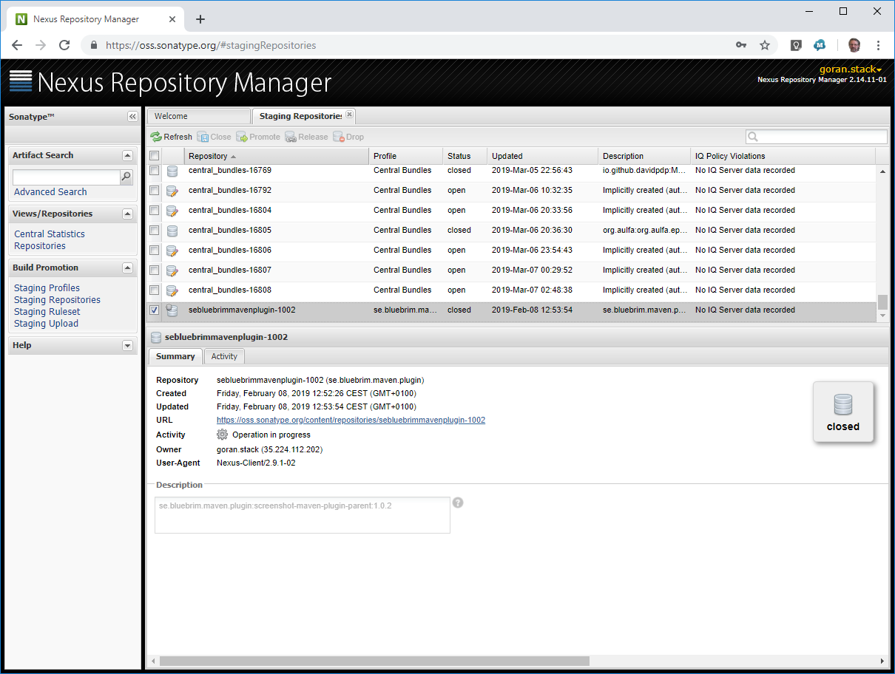

= Publish on Maven Central
:docinfo: shared
:icons: font

These steps requires that the project has published before otherwise you have to follow this:
https://central.sonatype.org/pages/producers.html[]

The Maven Travis setup in my open source project is based on: https://github.com/idealo/logback-redis/wiki/Release-Process that describes 
how to get rid of gpg key management and implement a trivial push-button release process with Github and TravisCI.

* Build a release by checking in a tag. The Travis build script will deploy a release with a version number same as the tag.
* Go to: https://oss.sonatype.org/#stagingRepositories and find the release as a Staging Repository. Follow this: https://central.sonatype.org/pages/releasing-the-deployment.html
* Wait

Links to Sonatype Jira and Nexus: +
https://issues.sonatype.org[] +
https://oss.sonatype.org/[]

