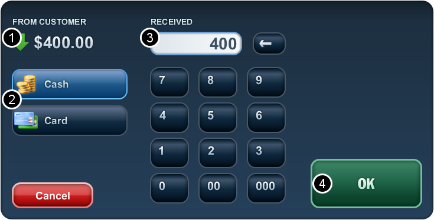
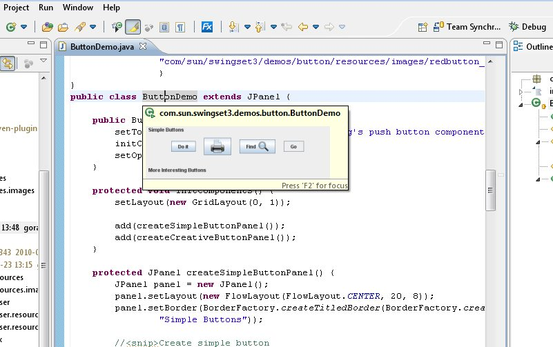
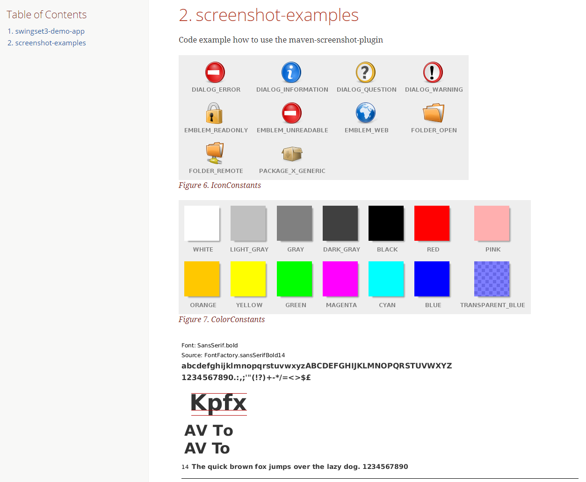
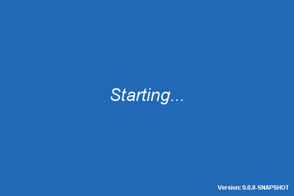

// Badges
image:http://img.shields.io/travis/goranstack/screenshot-maven-plugin/master.svg["Build Status (Travis CI)", link="https://travis-ci.org/goranstack/screenshot-maven-plugin"]
image:https://maven-badges.herokuapp.com/maven-central/se.bluebrim.maven.plugin/screenshot-maven-plugin/badge.svg["Maven Central",link="https://maven-badges.herokuapp.com/maven-central/se.bluebrim.maven.plugin/screenshot-maven-plugin"]

=  screenshot-maven-plugin
:toc: left
:icons: font
:sectnums:

Create Java Swing screenshots as part of your Maven build

== Introduction
The `screenshot-maven-plugin` is used to generate screenshots from Java Swing test classes.

The usual way to create screenshots is to start the application, navigate to the desired screen, use the screen capture
function in the OS to get a screenshot of the active window in the clip board and finally saving the screenshot by pasting
the content from the clip board to an image editing program. Sometimes you have to crop the image before saving it if the
captured window contains several sub panels and you only want a screenshot of one of them.

When screenshots are included in user manuals its common to decorate the screenshots with call outs that are referred
from the text. This creates even more work to create the screenshot since you have to manual add the call out graphics
in the image editor before saving it.

If your application supports multiple languages and you have to produce user manuals for those languages the steps above
have to be repeated for each supported language.

The `screenshot-maven-plugin` automates the task of creating those kind of screenshots with a little bit of coding from
your side

== The plugin goals

The plugin has three goals for various purposes:

* Create screenshots of UI components to include in the JavaDoc of your classes.

* Create a screenshot galleries of all your UI component. The gallery is created as an AsciiDoc article for further
processing to HTML, pdf or other format that AsciiDoctor is capable of.

* Create a splash screen with variable content such as version number. You can configure the JVM to show this splash screen
when starting up.

=== Screenshots for JavaDoc

The support for images in JavaDoc is excellent in Eclipse IDE and probably in other IDE's as well. You can see images in
some classes in the JDK for example in
 http://download.oracle.com/javase/6/docs/api/java/awt/LinearGradientPaint.html[LinearGradientPaint] and
 http://download.oracle.com/javase/6/docs/api/javax/swing/JLayeredPane.html[JLayeredPane].
 It's very easy to include images in the JavaDoc by adding an image tag such as
[source, xml]
----

----
and putting the corresponding image file in a doc-files folder in the same location as the source file of the class. +
See: 
http://www.oracle.com/technetwork/java/javase/documentation/index-137868.html#images[How to Write Doc Comments for the
Javadoc Tool - Including Images]

When developing a Swing based application it's nice to include an image in the JavaDoc for all classes and/or methods
that have a visual presentation. Your co-developers will be very happy when they discover that a visual representation
pop ups when hovering over a class in Eclipse.

.Hover a class name in Eclipse

This project include examples how to use the `screenshot-maven-plugin` to generate screenshots of panels in the
https://swingset3.dev.java.net/[SwingSet3] demo application. The screenshot above was created by the following steps:

. Add a method in a test class that returns an instance of the `ButtonDemo` class and annotate the method with
the `@Screenshot` annotation
+
[source, java]
----
@Screenshot 
public JComponent createButtonDemoScreenShot() { 
    return new ButtonDemo(); 
}
----

. Add an image tag to the JavaDoc of the `ButtonDemo` class
+
[source, java]
----
/**
 * 
 */  
----

. Run the javadoc goal of `screenshot-maven-plugin`.

=== Screenshot gallery

The `screenshot-maven-plugin` is capable of generating a screenshot gallery as an AsciiDoc article. You can create
an aggregated screenshot gallery for a multi module project where each module generates a section in the document that
appears in the Table of Contents.

.A gallery created of the axample modules in this project

This project is set up to process the AsciiDoc source to HTML and deployed to GitHub pages.

=== Splash screen
It's common to show a window with a progress bar and som info about the application when starting a Java desktop
application. By using the `splashscreen` goal you can create an image that includes variables from
the current build. There is a very nice http://www.mojohaus.org/templating-maven-plugin[templating-maven-plugin]
that you can use to filter Java source classes to inject Maven properties as constant values. The `screenshot-examples`
contains an example how this is done.

.Splash screen image created from the `SplashScreenPanel` class

=== Documentation
Instructions how to configure the plugin can be found at
http://goranstack.github.io/screenshot-maven-plugin[GitHub Pages]

'''
++++
<small>

The camera icon made by <a href="https://www.flaticon.com/authors/daniel-bruce" title="Daniel Bruce">Daniel Bruce</a> from <a href="https://www.flaticon.com/" title="Flaticon">www.flaticon.com</a> is licensed by <a href="http://creativecommons.org/licenses/by/3.0/" title="Creative Commons BY 3.0" target="_blank">CC 3.0 BY</a>

</small>
++++
